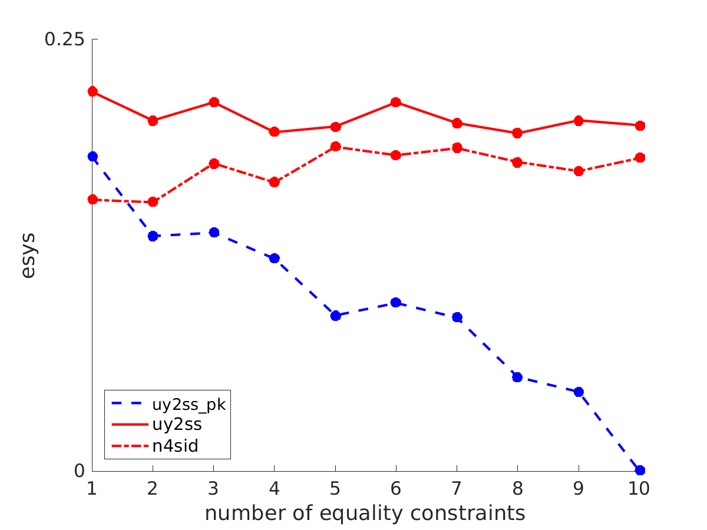
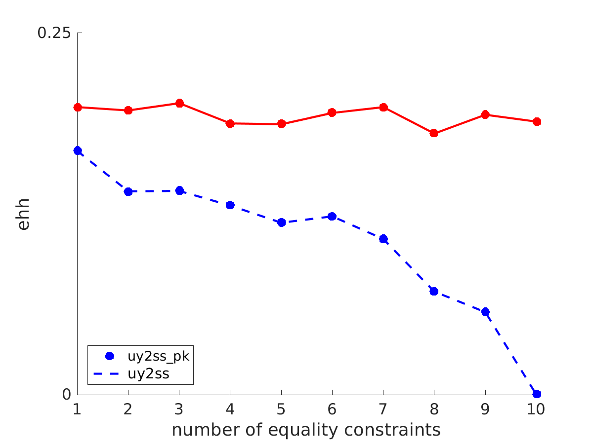
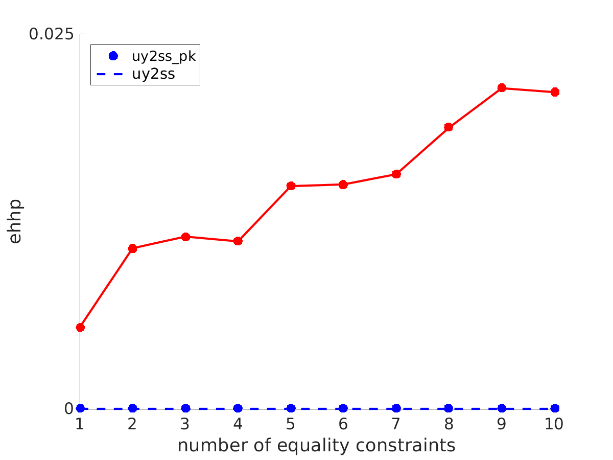
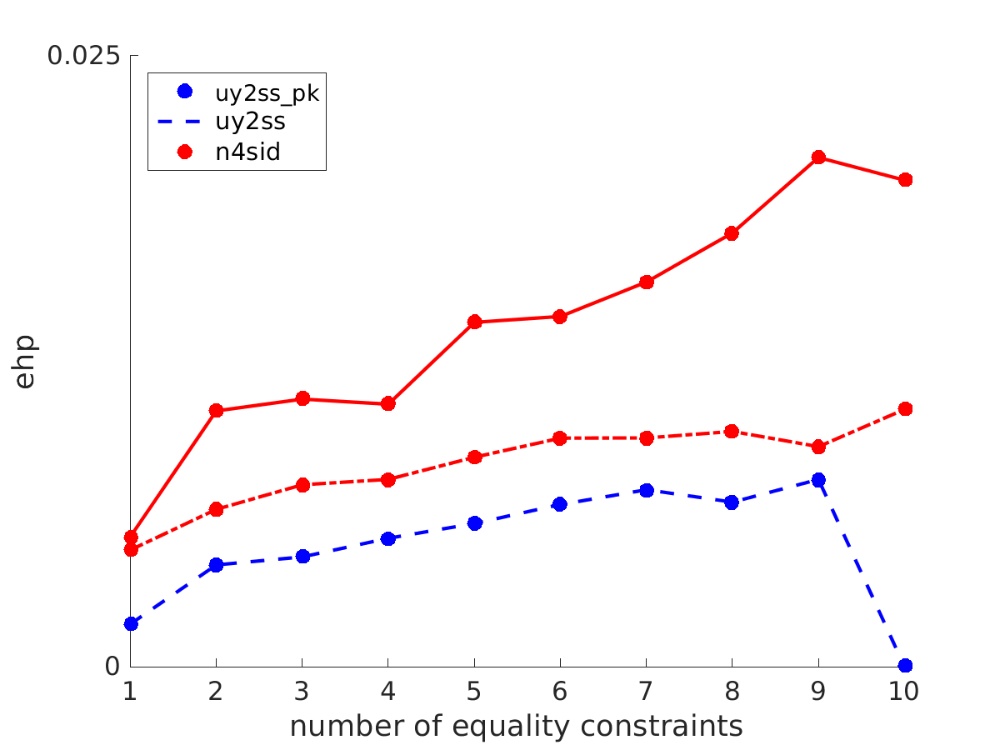
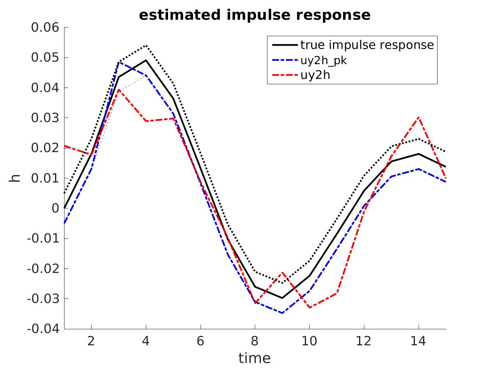
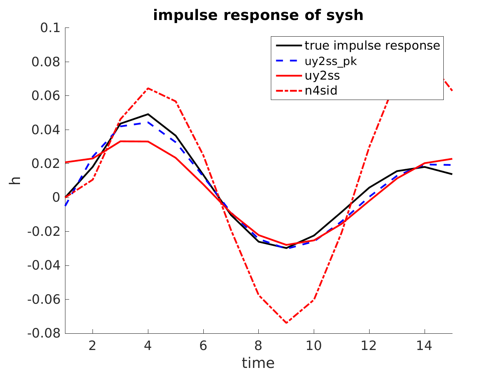

# Subspace identification with constraints on the impulse response

## Summary

Subspace identification methods may produce unreliable model estimates when a small number of noisy measurements are available. In such cases, the accuracy of the estimated parameters can be improved by using prior knowledge about the system. The function `uy2ss_pk` computes a state space representation from input/output data of the system, uses prior knowledge about the impulse response. The method has two steps: 

1.  estimation of the impulse response with linear equality and inequality constraints (`uy2h_pk`), and

2.  realization of the estimated impulse response (`h2ss`). In the case of prior knowledge expressed as equality constraints, the problem on step 1 admits a closed form solution. In the general case of equality and inequality constraints, the solution is computed by numerical optimization method (`lsqlin`).

## Usage

`[sys, h, hh] = uy2ss_pk(u, y, n, delta, e, f, ep, fp)`

-   `u` / `y` &#x2014; input/output data

-   `n` &#x2014; model order

-   `delta` &#x2014; number of estimated samples of the impulse response H

-   `e` / `f` &#x2014; (optional) equality constraint E \* H = F

-   `ep` / `fp` &#x2014; (optional) inequality constraint Ep \* H < FP

-   `sys` &#x2014; identified state space model

-   `h` &#x2014; impulse response of `sys`

-   `hh` &#x2014; impulse response estimated directly from `u` and `y`

## Demo

### Simulation setup

The true data is regularly sampled with a sampling period 0.2sec from a second order the continuous-time mass-spring-damper system. 

    %% simulation parameters
    T = 50;     % number of samples
    delta = 10; % number of to-be-estimated samples of the impulse response
    N = 100;    % number of Monte-Carlo repetitions
    s = 0.01;   % noise standard deviation
    eiv = 1;    % errors-in-variables or output error setup
    nu = 1; ny = 1; n = 2; % number of inputs / number of oututs / order
    
    %% true system
    m = 1; k = 10; d = 1;
    A = [0 1; -k/m -d/m]; B = [0; 1/m]; C = [1 0]; D = 0;
    sys = c2d(ss(A, B, C, D), 0.2); sys.ts = -1;
    H = impulse(sys, delta - 1);
    
    %% true data
    u0 = rand(T, nu); y0 = lsim(sys, u0); w0 = [u0 y0]; 

The identification data is obtained in either the errors-in-variables or the output error setting. This choice is controlled by the simulation parameter `eiv`.

### A single equality constraint `test_one`

First, we consider that prior knowledge is in the form of a single equality constraint, 

    e = ones(1, delta); f = e * H; ep = []; fp = [];

which models prior knowledge of the steady-state gain of the system. The model estimated with `uy2ss_pk` is compared with the models estimated by two alternative methods:

-   `uy2ss` &#x2014; the two-stage method estimating the impulse response as an intermediate step, but not using the prior knowledge, and

-   `n4sid` &#x2014; the N4SID method, implemented in the Identification Toolbox of Matlab, called with its default parameters.

The experiment is repeated 100 times with different noise realizations (Monte-Carlo simulation). We compare the average relative estimation errors of the identified model as well as the estimated impulse response.

    for j = 1:N
      if eiv
        wt = randn(T, nu + ny); w = w0 + s * norm(w0) * wt / norm(wt); 
      else
        wt = [zeros(T, nu) randn(T, ny)]; w = w0 + s * norm(w0(:, nu + 1:end)) * wt / norm(wt); 
      end
      u = w(:, 1:nu); y = w(:, nu+1:end);
      [sysh1, Hh1, Hh1_] = uy2ss_pk(u, y, n, delta, e, f, ep, fp);
      [sysh2, Hh2, Hh2_] = uy2ss_pk(u, y, n, delta);
      sysh3 = n4sid(iddata(y, u), n); Hh3 = impulse(sysh3, delta - 1);
      esys(j, :) = [norm(sys - sysh1) norm(sys - sysh2) norm(sys - sysh3)] / norm(sys);
      eh(j, :)   = [norm(vec(H - Hh1)) norm(vec(H - Hh2)) norm(vec(H - Hh3))] / norm(vec(H));
      ehh(j, :)  = [norm(vec(H - Hh1_)) norm(vec(H - Hh2_)) NaN] / norm(vec(H));
      ehp(j, :)   = [norm(vec(e * Hh1 - f)) norm(vec(e * Hh2 - f)) norm(vec(e * Hh3 - f))];
      ehhp(j, :)  = [norm(vec(e * Hh1_ - f)) norm(vec(e * Hh2_ - f)) NaN];
    end

The results

<table border="2" cellspacing="0" cellpadding="6" rules="groups" frame="hsides">

<colgroup>
<col  class="left" />

<col  class="right" />

<col  class="right" />

<col  class="left" />
</colgroup>
<thead>
<tr>
<th scope="col" class="left">&#xa0;</th>
<th scope="col" class="right">uy2ss_pk</th>
<th scope="col" class="right">uy2ss</th>
<th scope="col" class="left">n4sid</th>
</tr>
</thead>

<tbody>
<tr>
<td class="left">esys</td>
<td class="right">0.1385</td>
<td class="right">0.1572</td>
<td class="left">0.1031</td>
</tr>

<tr>
<td class="left">ehh</td>
<td class="right">0.1358</td>
<td class="right">0.1565</td>
<td class="left">---</td>
</tr>

<tr>
<td class="left">ehp</td>
<td class="right">0.0025</td>
<td class="right">0.0069</td>
<td class="left">0.0034</td>
</tr>

<tr>
<td class="left">ehhp</td>
<td class="right">0.0000</td>
<td class="right">0.0068</td>
<td class="left">---</td>
</tr>
</tbody>
</table>

show that using the prior knowledge (`uy2ss_pk`) leads to improvement compared with not using the prior knowledge (`uy2ss`). However, using a single equality constraints, in this simulation example, `n4sid` produces a better result than `uy2ss_pk`. We show in th next demo that with two or more equality constraints `uy2ss_pk` outperforms `n4sid`.

The equality constraints are satisfied exactly by the estimated impulse response obtained with `uy2h_pk` but not by the impulse response of the system obtained with `uy2ss_pk`. This is due to the extra approximation done on the realization step by `h2ss`. However, the estimated model of `uy2ss_pk` approximates the equality constraint better than the alternative methods `uy2ss` and `n4sid` that are not taking into account the prior knowledge.

### Multiple equality constraints `test_multiple`

This demo show how the estimation errors depend on the number of equality constraints. We use the same simulation setup as above with the matrix E now chosen as 

    E = tril(ones(10, delta)); F = E * H; ep = []; fp = [];

In this case, the prior knowledge F = E \* H is the initial samples of the step response of the true system. 

The results in 

and 

show that the estimation error for the subspace method using the prior knowledge reduces to zero as the number of equality constraints become 10. In general, the approximation error of `uy2ss_pk` decreases when more constraints are used.

Figures 

and 

shows the satisfaction of the equality constraint E \* H = F. As in the case of a single equality constraint, the equality constraints are satisfied exactly on the first step of `uy2ss_pk`. Although they are only approximately satisfied by the estimated model, the residual error is smaller than that of the alternative methods.

### Inequality constraints `test_ineq`

In this demo, we consider prior knowledge in the form of upper and lower bounds on the impulse response. The simulation setup is as above, however, now 20 samples of the impulse response are estimated and the data consists of 100 samples. The prior knowledge about the impulse response and the true impulse response are shown in `ijc_f4a.eps`. On the same plot are superimposed the estimated impulse responses by `uy2h` and `uy2h_pk`. 

Figure  
 
and
 
shows the true impulse response and the impulse responses of the models identified by the three methods compared: `uy2ss_pk`, `uy2ss`, and `n4sid`. The numerical values of the average relative estimation errors are 

<table border="2" cellspacing="0" cellpadding="6" rules="groups" frame="hsides">

<colgroup>
<col  class="left" />

<col  class="right" />

<col  class="right" />

<col  class="left" />
</colgroup>
<thead>
<tr>
<th scope="col" class="left">&#xa0;</th>
<th scope="col" class="right">uy2ss_pk</th>
<th scope="col" class="right">uy2ss</th>
<th scope="col" class="left">n4sid</th>
</tr>
</thead>

<tbody>
<tr>
<td class="left">esys</td>
<td class="right">0.2291</td>
<td class="right">0.2611</td>
<td class="left">1.4984</td>
</tr>

<tr>
<td class="left">ehh</td>
<td class="right">0.2022</td>
<td class="right">0.3235</td>
<td class="left">---</td>
</tr>
</tbody>
</table>

The results empirically confirm the advantage of using the given prior knowledge on the impulse response for the overall identification problem.
